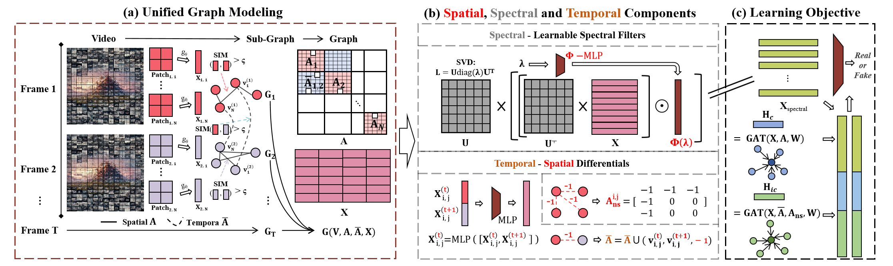

# SSTGNN: Spatial-Spectral-Temporal Graph Neural Network for Deepfake Detection

This is the official implementation of the paper:

> **When Deepfake Detection Meets Graph Neural Network: a Unified and Lightweight Learning Framework**  
> Haoyu Liu, Chaoyu Gong, Mengke He, Jiate Li, Kai Han, Siqiang Luo  
> [[arXiv]](https://arxiv.org/abs/2508.05526)

## Introduction

The proliferation of generative video models has made detecting AI-generated and manipulated videos an urgent challenge. Existing detection approaches often fail to generalize across diverse manipulation types due to their reliance on isolated spatial, temporal, or spectral information, and typically require large models to perform well.

**SSTGNN** is a lightweight Spatial-Spectral-Temporal Graph Neural Network framework that represents videos as structured graphs, enabling joint reasoning over:
- **Spatial inconsistencies** — artifacts within individual frames
- **Temporal artifacts** — unnatural motion patterns across frames  
- **Spectral distortions** — frequency-domain anomalies introduced by manipulation

SSTGNN incorporates learnable spectral filters and temporal differential modeling into a graph-based architecture, capturing subtle manipulation traces more effectively.

## Model Architecture

<p align="center">
  
</p>

## Project Structure

```
SSTGNN/
├── configs/
│   └── config.yaml          # Training configuration file
├── data/
│   └── data_here            # Place your dataset here
├── dataset/
│   ├── __init__.py
│   ├── dataloader.py        # Data loading utilities
│   └── utils.py             # Dataset helper functions
├── models/
│   ├── __init__.py
│   ├── mmtgnn.py             # Main SSTGNN model architecture
│   └── spectral.py           # Spectral feature extraction module
├── checkpoints/              # Model checkpoints
├── requirements.txt
├── train.py                  # Training script
└── test.py                   # Testing/evaluation script
```

## Requirements

```bash
pip install -r requirements.txt
```

## Quick Start

### 1. Prepare Dataset

Place your video dataset in the `data/` folder. The dataset should be organized with real and fake video samples.
We provide a sample dataset (FS) for testing purposes:
- **FS Sample**: [Download from Google Drive](https://drive.google.com/file/d/1vyJ2pR5HUu3Vp13IIaXNce8GleJwQghJ/view?usp=drive_link)

### 2. Configure Parameters

Modify `configs/config.yaml` according to your needs:

```yaml
gpu: 2                    # GPU device ID
epochs: 200               # Number of training epochs
lr: 0.0001                # Learning rate
batch_size: 16            # Batch size
patch_size: [32, 32]      # Patch size for frame division
window_size: 8            # Temporal window size

model:
  num_features: 128       # Feature dimension
  num_classes: 2          # Binary classification (real/fake)
  back_method: resnet50   # Backbone network
  hidden_dim: 256         # Hidden layer dimension
  num_frames: 8           # Number of frames per sample
  num_patches: 49         # Number of patches per frame
  multi_head: 8           # Number of attention heads
  temporal_window: 2      # Temporal graph window size
```

### 3. Train the Model

```bash
python train.py
```

The training process will:
- Save the best model to `checkpoints/sample/NT/MMTGNN_best.pth`
- Save periodic snapshots every 50 epochs
- Apply early stopping if no improvement for 100 epochs

## Citation

If you find this work useful, please cite:

```bibtex
@article{liu2025sstgnn,
  title={When Deepfake Detection Meets Graph Neural Network: a Unified and Lightweight Learning Framework},
  author={Liu, Haoyu and Gong, Chaoyu and He, Mengke and Li, Jiate and Han, Kai and Luo, Siqiang},
  journal={arXiv preprint arXiv:2508.05526},
  year={2025}
}
```
